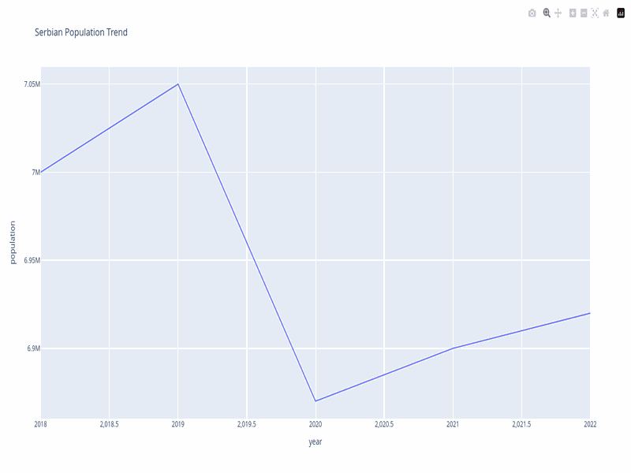
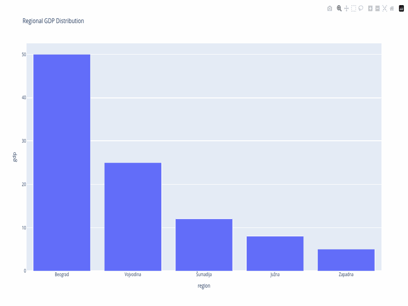
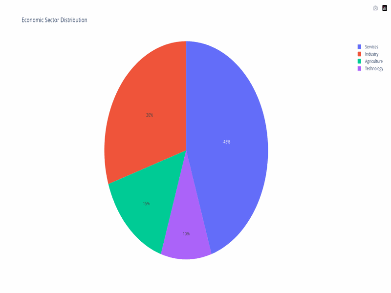

# Serbian Data MCP Server

[](https://pypi.org/project/serbian-data-mcp/)
[](https://pypi.org/project/serbian-data-mcp/)
[](https://opensource.org/licenses/MIT)
[](https://smithery.ai/server/acailic/serbian-data-mcp)

MCP server for accessing Serbian open data portal (data.gov.rs) with built-in visualization, storytelling, and analytics capabilities.

```
pip install serbian-data-mcp
```

## Features

### Data Access
- 🔍 Search 3,400+ datasets from Serbian government (data.gov.rs)
- 📥 Download data in JSON, CSV, XML, XLSX formats
- 🇷🇸 Full Serbian language support (UTF-8)
- 🚀 Built-in rate limiting and caching

### Visualization — 15+ Chart Types
- 📊 **Basic charts**: line, bar, pie, scatter, histogram, box plot
- 🗺️ **Maps**: choropleth (25 Serbian districts), bubble map, multi-layer map
- 📈 **Data journalism**: slope chart, waffle chart, population pyramid, sankey diagram, radar chart
- 🎯 **Advanced**: heatmap, treemap, gauge/donut, funnel, sparklines, animated timelines
- ✨ **Special**: arrow chart, dumbbell chart, lollipop chart

### Storytelling & Analytics
- 📰 **Infographics**: big number cards, auto-generated insights, timeline ribbon, data tables
- 📊 **Dashboards**: multi-panel layouts with mixed chart types
- 📜 **Scrollytelling**: scroll-driven HTML stories with IntersectionObserver
- 📈 **Forecasting**: linear/exponential projections with R² and growth rates
- 🏆 **Benchmarking**: compare against EU averages or custom references
- 🔍 **Cross-dataset analysis**: correlations, outliers, rank divergences

### Export & Sharing
- 🌐 **HTML**: styled, responsive pages with dark data-journalism aesthetic
- 🖼️ **PNG/PDF**: export with kaleido (graceful fallback if not installed)
- 📎 **Embed**: iframe embed code for websites/blogs
- 📋 **JSON**: raw Plotly spec for custom integration

### Data Tools
- 🔧 Transformation tools: filter, group, aggregate, sort, select
- 📋 Auto-extracted insights: extremes, temporal changes, rankings, outliers
- 💬 Auto-generated narrative summaries
- 🔧 Git repository visualization and analysis

## 🚀 Quick Start

### Install from PyPI (Recommended)

```bash
pip install serbian-data-mcp
```

Then add to your MCP client configuration (see [Usage](#-usage) below).

### Install from Smithery

[Smithery](https://smithery.ai) is a registry and CLI for discovering and installing MCP servers.

```bash
# Install the Smithery CLI
npm install -g smithery@latest

# Add to Claude Desktop
smithery mcp add acailic/serbian-data-mcp --client claude

# Add to Cursor
smithery mcp add acailic/serbian-data-mcp --client cursor

# Or connect as a remote Smithery connection
smithery mcp add acailic/serbian-data-mcp --id serbian-data
```

> **Note:** Requires Node.js 20+. After adding, restart your AI client for changes to take effect.

### Install from Source

```bash
git clone https://github.com/acailic/serbian-data-mcp
cd serbian-data-mcp
uv sync
```

## 📖 Configuration

The server works out of the box with sensible defaults. To customize, create a `config.json` in your working directory (or next to the installed package):

```json
{
  "api_base": "https://data.gov.rs",
  "rate_limit": 1.0,
  "timeout": 30,
  "cache_dir": ".cache",
  "export_dir": "exports"
}
```

See `config.example.json` in the source repo for all options.

## 🚀 Usage

### Claude Desktop Configuration

```json
{
  "mcpServers": {
    "serbian-data": {
      "command": "serbian-data-mcp"
    }
  }
}
```

Or if you installed from source:

```json
{
  "mcpServers": {
    "serbian-data": {
      "command": "python",
      "args": ["-m", "serbian_data_mcp"]
    }
  }
}
```

### Via Smithery CLI

If you installed via [Smithery](https://smithery.ai), the configuration is handled automatically. Just run:

```bash
# For Claude Desktop
smithery mcp add acailic/serbian-data-mcp --client claude

# For Cursor
smithery mcp add acailic/serbian-data-mcp --client cursor
```

Then restart your AI client. No manual config editing needed.

## 📊 Visualization Gallery

All charts feature a polished dark data-journalism theme with Inter font, refined hover styles, and consistent Serbian flag color palette. Three themes available: dark, light, and infographic.

### Line Charts — Time Series & Trends


### Bar Charts — Comparisons & Rankings


### Choropleth Map — Serbian Districts
Interactive map of 25 Serbian districts with Cyrillic/Latin name resolution, available as choropleth or bubble map.

### Population Pyramid — Demographics


### Slope Chart — Ranking Changes
Shows how district rankings shifted between censuses (2002 → 2022), with green for gainers and red for losers.

### Sankey Diagram — Budget Flows
Visualize budget flows from revenue sources through ministries to spending categories.

### Radar Chart — Multi-Metric Comparison
Compare cities across population, GDP per capita, schools, hospitals, and parks on a single spider plot.

### Waffle Chart — Proportional Data
"1 in 4 Serbs live in Belgrade" — each category gets a block of squares in a 10×10 grid.

### Donut Charts — Sector Distribution


### Infographics — Data Stories
Auto-generated single-page stories with big number cards, timeline ribbon, insights, and supporting charts.

### Dashboards — Multi-Panel Views
Combine multiple chart types into a single dashboard layout with big number KPIs.

### Scrollytelling — Scroll-Driven Stories
Interactive HTML stories that reveal data as the user scrolls, with IntersectionObserver animations.

## Examples

### Search & Visualize

```python
# Search datasets
datasets = await mcp.call_tool("search_datasets", {
    "query": "population",
    "format": "json",
    "page_size": 10
})

# Create a basic chart
chart = await mcp.call_tool("create_visualization", {
    "data": data,
    "chart_type": "line",
    "title": "Population Trends",
    "x_column": "year",
    "y_column": "population",
})

# Create an advanced chart (slope chart for census changes)
slope = await mcp.call_tool("create_slope_chart", {
    "data": census_data,
    "entity_column": "district",
    "start_column": "pop_2002",
    "end_column": "pop_2022",
    "title": "Census Ranking Changes 2002→2022"
})
```

### Forecast & Benchmark

```python
# Forecast future GDP
forecast = await mcp.call_tool("forecast_data", {
    "data": gdp_data,
    "time_column": "year",
    "value_column": "gdp",
    "periods_ahead": 5
})

# Compare against benchmarks
comparison = await mcp.call_tool("benchmark_data", {
    "data": city_data,
    "value_column": "gdp_pc",
    "entity_column": "city",
    "benchmarks": {"EU average": 35000}
})
```

### Create a Full Infographic

```python
story = await mcp.call_tool("create_infographic", {
    "data": population_data,
    "title": "Srbija po Popisu 2022",
    "chart_type": "bar",
    "x_column": "district",
    "y_column": "population_2022",
    "extra_big_numbers": [
        {"number": "6.6M", "label": "Ukupno stanovnika", "color": "gold", "trend": "down"},
        {"number": "23%", "label": "Beograd region", "color": "blue", "trend": "up"},
    ],
    "timeline_events": [
        {"year": "2002", "label": "Popis 2002", "dot_class": ""},
        {"year": "2022", "label": "Popis 2022", "dot_class": "gold"},
    ]
})
```

## Available MCP Tools

### Data Access
| Tool | Description |
|------|-------------|
| `search_datasets` | Search 3,400+ datasets with filters |
| `get_dataset` | Get complete dataset details |
| `get_resource_data` | Download and parse resource data |
| `list_organizations` | Browse data providers |
| `suggest_datasets` | Autocomplete for search |

### Data Transformation
| Tool | Description |
|------|-------------|
| `filter_data` | Filter rows by conditions |
| `group_data` | Group and aggregate |
| `sort_data` | Sort by column(s) |
| `select_columns` | Select/rename columns |
| `data_profile` | Statistical summary of dataset |

### Basic Charts
| Tool | Description |
|------|-------------|
| `create_visualization` | Line, bar, pie, scatter, histogram, box plot |
| `create_advanced_visualization` | Heatmap, treemap, gauge, funnel, sparklines, animated |
| `create_arrow_chart` | Directional arrow chart |
| `create_dumbbell_chart` | Before/after comparison |

### Novel Charts
| Tool | Description |
|------|-------------|
| `create_slope_chart` | Ranking changes between two periods |
| `create_waffle_chart` | Proportional icon grid |
| `create_population_pyramid` | Age × sex demographic distribution |
| `create_sankey_diagram` | Budget/energy flow visualization |
| `create_radar_chart` | Multi-metric spider comparison |

### Maps
| Tool | Description |
|------|-------------|
| `create_choropleth_map` | Colored district map of Serbia |
| `create_bubble_map` | Bubble-sized district map |
| `create_multi_layer_map` | Toggle between indicators |

### Analytics & Forecasting
| Tool | Description |
|------|-------------|
| `forecast_data` | Linear/exponential projections |
| `benchmark_data` | Compare against reference values |
| `compare_cross_dataset` | Cross-dataset correlations |

### Storytelling
| Tool | Description |
|------|-------------|
| `create_infographic` | Full data story with KPIs, timeline, chart, insights |
| `create_dashboard` | Multi-panel dashboard layout |
| `create_scrollytelling` | Scroll-driven interactive story |

### Export & Sharing
| Tool | Description |
|------|-------------|
| `export_visualization` | Export as HTML, JSON, PNG, or PDF |
| `generate_embed` | Generate iframe embed code |
| `enhance_chart_tooltips` | Add rich contextual tooltips |

## 📚 Documentation

- **[Quick Start Guide](docs/QUICKSTART.md)** — Get started in 5 minutes
- **[Usage Examples](docs/EXAMPLES.md)** — 24+ real-world examples and use cases
- **[API Reference](docs/API_REFERENCE.md)** — Complete tool documentation with parameters
- **[Troubleshooting](docs/TROUBLESHOOTING.md)** — Common issues and solutions
- **[Contributing Guide](docs/CONTRIBUTING.md)** — Developer contribution guidelines

## Development

### Setup Development Environment

```bash
make install
```

### Generate Showcase Exports

```bash
uv run python generate_showcase.py
```

This creates 12 polished HTML files in `exports/` demonstrating all chart types with sample Serbian data.

### Running Tests

```bash
make test       # Run all tests with coverage
make test-quick # Quick tests (no coverage)
```

### Code Quality Checks

```bash
make check      # Run all quality checks (lint, format, type-check, security)
make check-quick # Quick checks (lint + format only)
```

## Project Structure

```
serbian-data-mcp/
├── exports/                     # Generated HTML visualizations
├── src/serbian_data_mcp/
│   ├── api/                     # API client for data.gov.rs
│   ├── catalog/                 # Dataset catalog and search
│   ├── data/                    # Data parsing and transformation
│   ├── intelligence/            # Query expansion and smart search
│   ├── viz/
│   │   ├── charts.py            # Basic 6 chart types (auto-themed)
│   │   ├── advanced_charts.py   # Heatmap, treemap, gauge, funnel, sparklines
│   │   ├── novel_charts.py      # Slope, waffle, pyramid, sankey, radar
│   │   ├── maps.py              # Choropleth map of 25 Serbian districts
│   │   ├── map_advanced.py      # Bubble map, multi-layer map
│   │   ├── infographics.py      # Full infographic builder
│   │   ├── scrollytelling.py    # Scroll-driven HTML stories
│   │   ├── animations.py        # Animated charts (timeline, bars, comparison)
│   │   ├── themes.py            # Dark/light/infographic themes
│   │   ├── insights.py         # Auto-extracted insights & narratives
│   │   ├── tooltips.py          # Rich hover tooltips
│   │   ├── forecast.py          # Linear/exponential forecasting
│   │   ├── data_tables.py        # Styled data tables
│   │   ├── special_charts.py    # Arrow, dumbbell, lollipop
│   │   ├── exporters.py         # HTML/PNG/JSON/PDF/export
│   │   └── datawrapper_export.py # Datawrapper cloud API
│   ├── config.py                # Configuration management
│   ├── exceptions.py            # Custom exceptions
│   └── tools.py                 # MCP tool definitions (30+ tools)
├── tests/                       # Comprehensive test suite (314 tests)
├── generate_showcase.py         # Generate showcase HTML exports
├── .github/workflows/           # CI/CD configuration
├── pyproject.toml               # Project configuration
└── Makefile                     # Development commands
```

## License

MIT License - see LICENSE file
