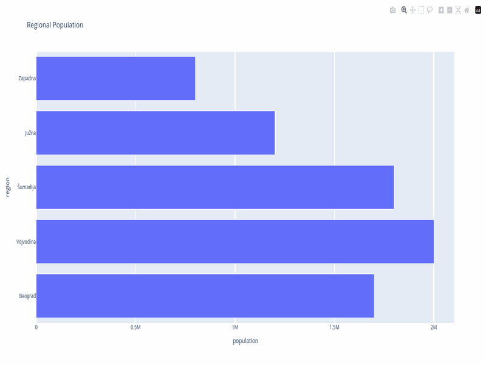
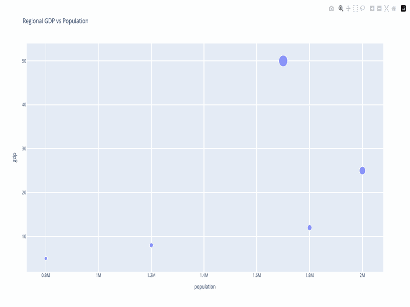
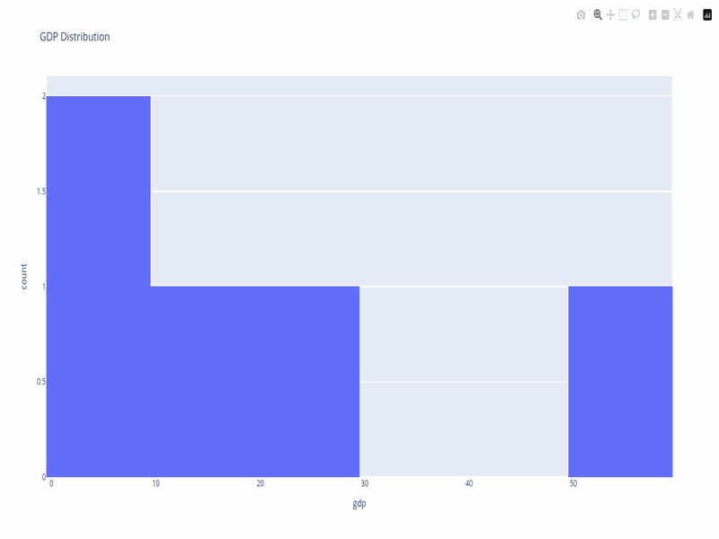
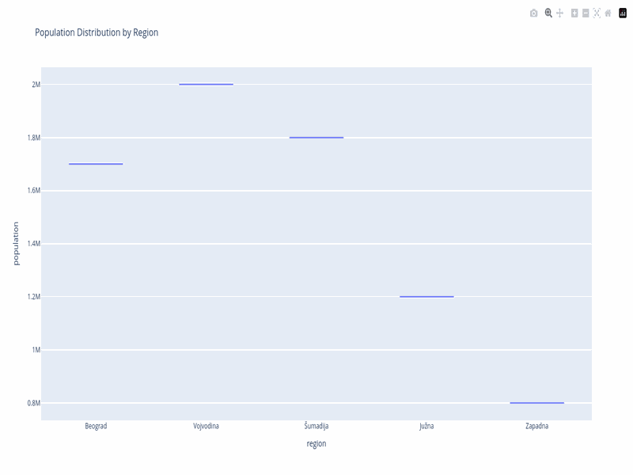

# Serbian Data MCP Server

[](https://pypi.org/project/serbian-data-mcp/)
[](https://pypi.org/project/serbian-data-mcp/)
[](https://opensource.org/licenses/MIT)

MCP server for accessing Serbian open data portal (data.gov.rs) with built-in visualization capabilities.

```
pip install serbian-data-mcp
```

## Features

- 🔍 Search 3,400+ datasets from Serbian government
- 📊 Create 6 types of charts (line, bar, pie, scatter, histogram, box)
- 📥 Download data in JSON, CSV, XML, XLSX formats
- 🎨 Export visualizations as HTML/PNG/JSON
- 🇷🇸 Full Serbian language support (UTF-8)
- 🚀 Built-in rate limiting and caching
- 🛠️ Data transformation tools (filter, group, aggregate, sort, select)
- 🔧 Git repository visualization and analysis

## 🚀 Quick Start

### Install from PyPI (Recommended)

```bash
pip install serbian-data-mcp
```

Then add to your MCP client configuration (see [Usage](#-usage) below).

### Install from Source

```bash
git clone https://github.com/acailic/serbian-data-mcp
cd serbian-data-mcp
uv sync
```

## 📖 Configuration

The server works out of the box with sensible defaults. To customize, create a `config.json` in your working directory (or next to the installed package):

```json
{
  "api_base": "https://data.gov.rs",
  "rate_limit": 1.0,
  "timeout": 30,
  "cache_dir": ".cache",
  "export_dir": "exports"
}
```

See `config.example.json` in the source repo for all options.

## 🚀 Usage

### Claude Desktop Configuration

```json
{
  "mcpServers": {
    "serbian-data": {
      "command": "serbian-data-mcp"
    }
  }
}
```

Or if you installed from source:

```json
{
  "mcpServers": {
    "serbian-data": {
      "command": "python",
      "args": ["-m", "serbian_data_mcp"]
    }
  }
}
```

### Available Tools

- `search_datasets` - Search datasets with filters
- `get_dataset` - Get complete dataset details
- `get_resource_data` - Download and parse resource data
- `create_visualization` - Create charts from data
- `list_organizations` - Browse data providers
- `suggest_datasets` - Autocomplete for search
- `get_git_stats` - Get git repository statistics
- `get_git_history` - Retrieve commit history
- `visualize_git_data` - Create git repository visualizations

## 📊 Visualization Gallery

The MCP server supports 6 types of interactive charts with automatic styling and Serbian language support.

### Line Charts


*Perfect for time series data and trends*

### Bar Charts


*Compare values across categories*

### Horizontal Bar Charts


*Ideal for long category names*

### Pie Charts


*Show parts of a whole*

### Scatter Plots


*Explore relationships between variables*

### Histograms


*Analyze frequency distributions*

### Box Plots


*Display statistical summaries and outliers*

## Examples

```python
# Search datasets
datasets = await mcp.call_tool("search_datasets", {
    "query": "population",
    "format": "json",
    "page_size": 10
})

# Create visualization
chart = await mcp.call_tool("create_visualization", {
    "data": data,
    "chart_type": "line",
    "title": "Population Trends",
    "x_column": "year",
    "y_column": "population",
    "export_format": "html"
})
```

## 📚 Documentation

- **[Quick Start Guide](docs/QUICKSTART.md)** - Get started in 5 minutes
- **[Usage Examples](docs/EXAMPLES.md)** - 24+ real-world examples and use cases
- **[API Reference](docs/API_REFERENCE.md)** - Complete tool documentation with parameters
- **[Troubleshooting](docs/TROUBLESHOOTING.md)** - Common issues and solutions
- **[Contributing Guide](docs/CONTRIBUTING.md)** - Developer contribution guidelines

## Development

### Setup Development Environment

```bash
make install
```

### Running Tests

```bash
make test       # Run all tests with coverage
make test-quick # Quick tests (no coverage)
```

### Code Quality Checks

```bash
make check      # Run all quality checks (lint, format, type-check, security)
make check-quick # Quick checks (lint + format only)
```

## Project Structure

```
serbian-data-mcp/
├── src/serbian_data_mcp/
│   ├── api/              # API client and models
│   ├── catalog/          # Dataset catalog and search
│   ├── data/             # Data parsing and transformation
│   ├── intelligence/     # Query expansion and smart search
│   ├── viz/              # Visualization tools
│   ├── config.py         # Configuration management
│   ├── exceptions.py     # Custom exceptions
│   └── tools.py          # MCP tool definitions
├── tests/                # Comprehensive test suite
├── .github/workflows/    # CI/CD configuration
├── pyproject.toml        # Project configuration
└── Makefile              # Development commands
```

## License

MIT License - see LICENSE file
